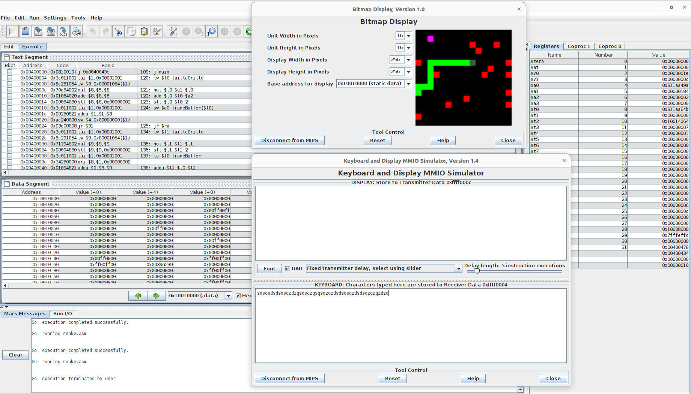

# SnakeMIPS

<p>
Snake game coded in MIPS assembly.<br/>
Eat the candies and dodge the obstacles.
<p/>

<p align="center">

<p/>

# Instructions

- Start the Mars emulator with the following command :

```
java -jar Mars.jar
```

- Open the file **snake.asm**.

- We must then activate the display and keyboard inputs recording.

- Go to the **Tools** tab and click on **Bitmap Display** and then on **Keyboard and display MMIO Simulator**.

- Inside each widgets, click on **Connect to MIPS**.

- Inside the **Bitmap Display** widget set the width and height units to 16, and set the width and height display to 256.

- Now click on Run -> Assemble, then Run -> Go

- You can move the snake by pressing the z(up), s(down), d(right) and q(left) buttons of your keyboard inside the Keyboard and Display MMIO Simulator widget (bottom window).
